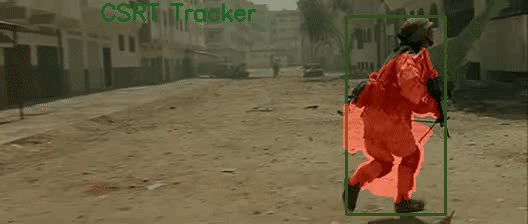
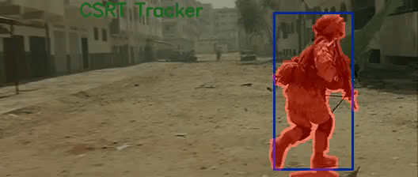
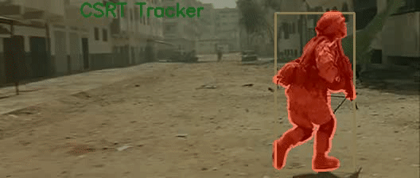

# Non-rigid Multi-object Tracking
**Azzolin Steve, Destro Matteo** \
**Signal, Image and Video** \
**Year 2020/21**

## Get started

### Import the conda env
- Run `conda env create -f environment.yaml`.
- Run `conda activate non_rigid_tracking`.
- **Note:** In case you want to run the Lin-pun tracker, you also need to compile some additional C libraries by running `cd prim && make`.

### Run sample
Simply run `main.py` to run the algorithm with the default parameters and configurations.

### Configurations
`config.yaml` contains all the configurable parameters for the maskers. The most important ones are:
- `input_video`: path of the video to use, relative to the root directory of the project.
- `masker`: identifier of the masker to be used, see section [Maskers](#maskers) for a list of the available maskers.
- `manual_roi_selection`: set to False to use the polygon specified in the `pts` parameter as initial selection. If set to True, the algorithm asks for a manual selection. 
- `show_masks`: Set to True to show the resulting mask while running the algorithm.

See the comments in `config.yaml` for more details and a description of the other parameters.

## Project structure

### Maskers
The folder `masker` contains separate classes for each algorithm proposal. The available maskers are:
- **BgSub** (`bg_subtractor_masker.py`): background subtractor.
- **LinPuntracker** (`lin_pun_tracker.py`): Lin-pun highly non-rigid object tracker. Please note that this algorithm was not thoroughly tested.
- **OpticalFlow** (`optical_flow_masker.py`): Optical Flow and Convex Hull masker (OFCH).
- **PC** (`pixel_classification.py`): Pixel Classification (PC) masker.
- **GrabCut** (`grab_cut.py`): GrabCut-based algorithm.

### Input/Output
The videos used for testing the algorithms are available in the `Input` folder. These videos were taken from the [Seg Track V2](https://web.engr.oregonstate.edu/~lif/SegTrack2/dataset.html) public dataset.

After running the algorithm, the resulting mask can be found inside `Output` (or in the custom folder specified in `config.yaml`).

### Benchmark
`benchmark.py` is a utility script to easily test different parameters combination automatically. It is useful in particular with the *SemiSupervised* tracker which has many hyper-parameters.

The benchmark uses `config_benchmark.yaml` as config file (see section [Configurations](#configurations) for more details). For hyper-parameter testing, inside of `benchmark.py` two variables can be found:
- `VIDEOS`: the file names of the video files we want to run the benchmark on. Note that if you want to add a new video to the benchmark, you need to define the points of the selection masks in `polygons.yaml`.
- `HYPERPARAMS`: contains, for each hyper-parameter, a list of values to be tested, for which the script automatically generates and tests any possible combination.

The results are then saved into `benchmark_results.csv`, with the obtained benchmark and the processing time required for each video.

## Results
The following table show the results for the three best approaches proposed. The benchmark score was computed with the intersection over union (IoU) metric.

| Sequence  | OFCH | PC   | GrabCut |
| --------- | ---- | ---- | ------- |
| Parachute | 0.60 | 0.77 |  0.79   |
| Soldier   | 0.58 | 0.74 |  0.75   |
| Worm      | 0.35 | 0.72 |  0.73   |
| Frog      | 0.32 | 0.76 |  0.61   |

\
Below an example of the resulting mask for each algorithm:

 \
*OFCH tracker* 
 

 \
*PC tracker*

 \
*GrabCut tracker*